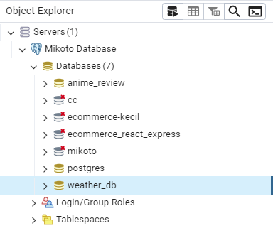
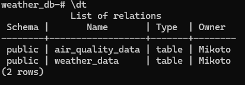
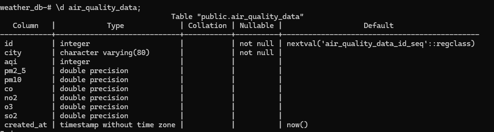
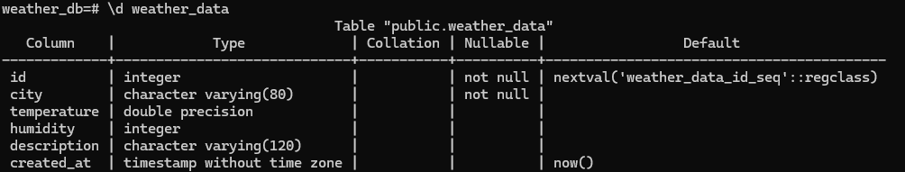
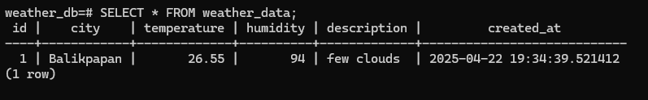

# 🌦️ Cloud Weather Tracker
## Pekan 10: Pengembangan Backend Microservices

## Checkpoint:
1. Membuat minimal 2 layanan backend terpisah menggunakan Flask
2. Mengimplementasikan REST API endpoints
3. Menyiapkan PostgreSQL database dan schema
4. Membuat Dockerfile untuk layanan backend

## Jawaban
### 1. Membuat minimal 2 layanan backend terpisah menggunakan Flask

Untuk memenuhi poin ini, saya telah mengembangkan dua layanan backend terpisah menggunakan framework Flask, yang masing-masing melayani tujuan yang berbeda.

1. Layanan pertama adalah API Cuaca, yang berfungsi untuk mengambil data cuaca terkini dari API OpenWeather. Layanan ini menangani request dari pengguna terkait informasi cuaca seperti suhu, kelembapan, dan deskripsi cuaca.

2. Layanan kedua adalah API Kualitas Udara, yang menyediakan informasi terkait kualitas udara seperti AQI (Air Quality Index), serta konsentrasi berbagai komponen udara seperti CO, NO2, dan PM2.5. Data ini diambil dari API OpenWeather yang menyediakan informasi tentang polusi udara berdasarkan koordinat geolokasi.

dimana untuk file nya seperti berikut 

```python

from models import db
from models.weather import WeatherData
from models.air_quality import AirQualityData
import requests
from config import Config

def get_weather_and_air_quality(city):
    api_key = Config.API_KEY

    # Ambil data cuaca
    weather_url = f'https://api.openweathermap.org/data/2.5/weather?q={city}&appid={api_key}&units=metric'
    weather_response = requests.get(weather_url)

    if weather_response.status_code != 200:
        return None, None

    weather_data = weather_response.json()

    # Ambil data kualitas udara
    lat = weather_data["coord"]["lat"]
    lon = weather_data["coord"]["lon"]

    air_url = f'https://api.openweathermap.org/data/2.5/air_pollution?lat={lat}&lon={lon}&appid={api_key}'
    air_response = requests.get(air_url)

    if air_response.status_code != 200:
        return weather_data, None

    air_data = air_response.json()

    # Simpan data ke database
    city_name = weather_data["name"]

    # Simpan cuaca
    weather_entry = WeatherData(
        city=city_name,
        temperature=weather_data["main"]["temp"],
        humidity=weather_data["main"]["humidity"],
        description=weather_data["weather"][0]["description"]
    )
    db.session.add(weather_entry)

    # Simpan kualitas udara
    air_quality_entry = AirQualityData(
        city=city_name,
        aqi=air_data["list"][0]["main"]["aqi"],
        pm2_5=air_data["list"][0]["components"]["pm2_5"],
        pm10=air_data["list"][0]["components"]["pm10"],
        co=air_data["list"][0]["components"]["co"],
        no2=air_data["list"][0]["components"]["no2"],
        o3=air_data["list"][0]["components"]["o3"],
        so2=air_data["list"][0]["components"]["so2"]
    )
    db.session.add(air_quality_entry)

    # Commit ke database
    db.session.commit()

    return weather_data, air_data


```

### 2. Mengimplementasikan REST API endpoints

Untuk memenuhi poin ini, Saat ini saya telah mengimplementasikan beberapa REST API endpoints yang dapat digunakan untuk mengambil data dari layanan cuaca dan kualitas udara.

1. Endpoint /api menerima request POST dengan parameter berupa nama kota (misalnya "Jakarta"), kemudian mengakses dua API eksternal (OpenWeather untuk cuaca dan kualitas udara). Endpoint ini akan mengembalikan data cuaca serta kualitas udara dalam format JSON kepada pengguna.

2. Fungsi API Cuaca mengambil data cuaca dari API OpenWeather berdasarkan kota yang diminta dan mengembalikan informasi seperti suhu, kelembapan, tekanan udara, dan deskripsi cuaca.

3. Fungsi API Kualitas Udara mengambil data kualitas udara dari API OpenWeather berdasarkan koordinat kota yang diminta, kemudian mengembalikan informasi mengenai AQI (Air Quality Index) serta komponen polusi udara seperti CO, NO2, PM2.5, dan lain-lain.

dimana untuk saat ini route nya seperti berikut 

```python
@app.route('/api', methods=["POST", "GET"])
def api():
    if request.method == "POST":
        data = request.get_json()
        if data and "city" in data:
            city = data["city"]
            weather, air_quality = get_weather_and_air_quality(city)

            if weather:
                return jsonify({
                    "weather": weather,
                    "air_quality": air_quality
                })
            else:
                return jsonify({"error": "Failed to fetch weather data"}), 400

    return jsonify({"message": "Hello from Flask"})
```

Lalu untuk melakukan testing API nya menggunakan Postman dengan request POST dengan parameter berupa nama kota (misalnya "Balikpapan"), maka akan mendapatkan response JSON berisi data cuaca dan kualitas udara.

### 3. Menyiapkan PostgreSQL database dan schema

Untuk memenuhi poin ini, saya telah menyiapkan PostgreSQL database dan schema untuk menyimpan data yang diperoleh dari API cuaca dan kualitas udara.

1. Database yang digunakan adalah weather_db, yang dibuat di PostgreSQL.



2. Tabel pertama adalah weather_data, yang menyimpan data cuaca seperti suhu, kelembapan, deskripsi cuaca, dan waktu pencatatan.


3. Tabel kedua adalah air_quality_data, yang menyimpan data kualitas udara, termasuk AQI (Air Quality Index), konsentrasi komponen polusi udara seperti CO, NO2, PM2.5, dan waktu pencatatan.


lalu juga untuk hasil request data dari API akan tersimpan ke dalam database contohnya saya memanggil city Balikpapan dan akan tersimpan seperti ini 


### 4. Membuat Dockerfile untuk layanan backend
Untuk memenuhi poin ini, saya telah membuat Dockerfile yang digunakan untuk menjalankan aplikasi backend berbasis Flask dalam container Docker. Dockerfile ini menyediakan langkah-langkah yang diperlukan untuk mengonfigurasi lingkungan yang diperlukan untuk menjalankan aplikasi.

```Dockerfile
# Gunakan image Python yang sudah ada di Docker Hub
FROM python:3.9-slim

# Set working directory di dalam container
WORKDIR /app

# Salin semua file dari project ke dalam container
COPY . /app

# Install dependensi yang ada di requirements.txt
RUN pip install --no-cache-dir -r requirements.txt

# Ekspose port 5000 untuk aplikasi Flask
EXPOSE 5000

# Jalankan aplikasi Flask
CMD ["python", "app.py"]
```

Dockercompose nya seperti berikut

```yaml
version: '3.8'

services:
  # Service untuk backend Flask
  backend:
    build:
      context: ./BE  # Lokasi Dockerfile untuk backend
    container_name: weather-backend
    ports:
      - "5000:5000"  # Mapped ke port 5000 lokal
    environment:
      - DATABASE_URL=postgresql://Mikoto:0@db:5432/weather_db  # Koneksi ke database
    depends_on:
      - db  # Menunggu database untuk siap
    networks:
      - weather-network

  # Service untuk PostgreSQL
  db:
    image: postgres:13  # Gunakan image resmi PostgreSQL
    container_name: weather-db
    environment:
      - POSTGRES_USER=Mikoto
      - POSTGRES_PASSWORD=0
      - POSTGRES_DB=weather_db
    ports:
      - "5432:5432"  # Mapped ke port 5432 lokal
    volumes:
      - weather-db-data:/var/lib/postgresql/data  # Persisten data DB
    networks:
      - weather-network

# Network agar service bisa saling berkomunikasi
networks:
  weather-network:
    driver: bridge

# Volume untuk menyimpan data PostgreSQL
volumes:
  weather-db-data:
    driver: local
```

dan hasil nya seperti berikut

1. Build 

2. Run 


untuk preview hasil run nya kenapa hanya "Hello from flask" dikarenakan format Json nya berada di console outputnya