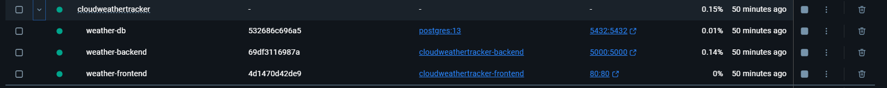
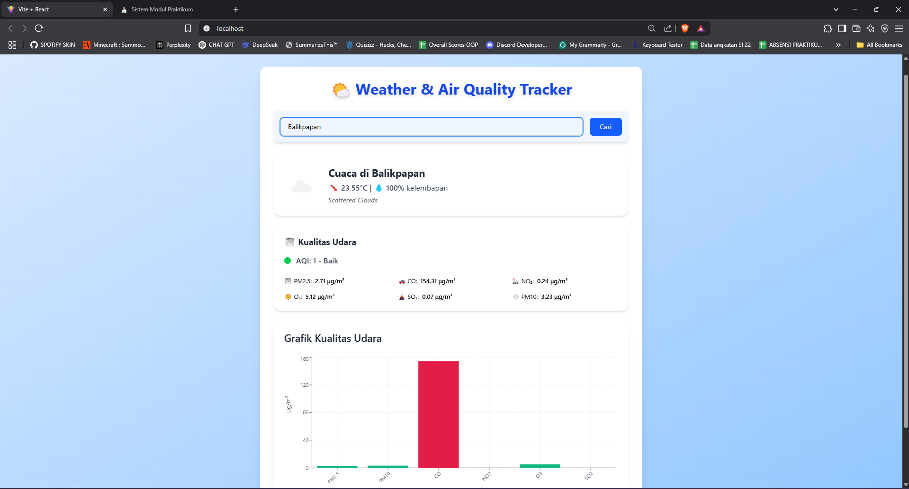

# 🌦️ Cloud Weather Tracker
## Pekan 11: Pengembangan Frontend

## Checkpoint 
1. Mengembangkan UI dengan React+Vite
2. Mengimplementasikan halaman dan komponen utama
3. Integrasi dengan API backend menggunakan fetch/axios
4. Membuat Dockerfile untuk frontend

## Jawaban Checkpoint

### 1. Pengembangan UI dengan React + Vite
- Mengembangkan antarmuka pengguna menggunakan React dan Vite.

- Implementasi komponen utama seperti WeatherCard, AirQualityCard, dan AirQualityChart untuk menampilkan data cuaca dan kualitas udara dengan desain modern dan responsif.

### 2. Mengimplementasikan halaman dan komponen utama
Kami menggunakan Axios untuk mengintegrasikan frontend dengan backend, mengambil data cuaca dan kualitas udara dari server.

Contoh Kode Implementasi yang saya sederhanakan:

```javascript
import React, { useEffect, useState } from 'react';
import axios from 'axios';
import WeatherCard from './WeatherCard';
import AirQualityCard from './AirQualityCard';

const WeatherApp = () => {
  const [weatherData, setWeatherData] = useState(null);
  const [airQualityData, setAirQualityData] = useState(null);

  useEffect(() => {
    // Mengambil data cuaca
    axios.get('https://api.openweathermap.org/data/2.5/weather?q=Jakarta&appid=YOUR_API_KEY')
      .then(response => {
        setWeatherData(response.data);
      });

    // Mengambil data kualitas udara
    axios.get('https://api.openweathermap.org/data/2.5/air_pollution?lat=-6.2088&lon=106.8456&appid=YOUR_API_KEY')
      .then(response => {
        setAirQualityData(response.data);
      });
  }, []);

  return (
    <div className="space-y-6">
      {weatherData && <WeatherCard data={weatherData} />}
      {airQualityData && <AirQualityCard data={airQualityData} />}
    </div>
  );
};

export default WeatherApp;
```

### 3. Integrasi dengan API backend menggunakan fetch/axios

Kami membuat Dockerfile untuk membangun dan menjalankan aplikasi frontend menggunakan Nginx.

```dockerfile
# Step 1: Build the React app
FROM node:18 AS build

# Set working directory inside the container
WORKDIR /app

# Copy package.json and package-lock.json (or yarn.lock) and install dependencies
COPY package*.json ./
RUN npm install

# Copy the rest of the application code
COPY . .

# Build untuk production menggunakan Vite
RUN npm run build

# Gunakan Nginx untuk serve static file
FROM nginx:stable-alpine
COPY --from=0 /app/dist /usr/share/nginx/html

EXPOSE 80
CMD ["nginx", "-g", "daemon off;"]
```

# Deliverables 

### 1. Dokumen Proyek (Markdown)
Dokumen ini berisi penjelasan mengenai tujuan aplikasi, struktur pengembangan, teknologi yang digunakan, serta penjelasan mendetail mengenai setiap komponen dan fitur yang ada dalam aplikasi, Update akan dilakukan pada Github


### 2. Kode Frontend: Komponen React dan Halaman Utama
Berikut adalah contoh kode komponen utama yang digunakan untuk menampilkan data cuaca dan kualitas udara:

## AirQualityCard.jsx
```jsx
import React from 'react';

const getAQIDescription = (aqi) => {
  switch (aqi) {
    case 1:
      return { label: 'Baik', color: 'bg-green-500' };
    case 2:
      return { label: 'Sedang', color: 'bg-yellow-400' };
    case 3:
      return { label: 'Tidak Sehat untuk Sensitif ', color: 'bg-orange-400' };
    case 4:
      return { label: 'Tidak Sehat', color: 'bg-red-500' };
    case 5:
      return { label: 'Sangat Tidak Sehat', color: 'bg-purple-700' };
    default:
      return { label: 'Tidak diketahui', color: 'bg-gray-400' };
  }
};

const AirQualityCard = ({ data }) => {
  const components = data.components;
  const { label, color } = getAQIDescription(data.main.aqi);

  return (
    <div className="bg-white rounded-2xl shadow-md p-6">
      <h3 className="text-xl font-bold text-gray-800 flex items-center gap-2 mb-4">
        🌫️ Kualitas Udara
      </h3>

      <div className="flex items-center gap-3 mb-6">
        <div className={`w-4 h-4 rounded-full ${color}`} />
        <p className="text-gray-700 font-medium text-lg">
          AQI: {data.main.aqi} - {label}
        </p>
      </div>

      <div className="grid grid-cols-2 sm:grid-cols-3 gap-4 text-sm">
        <div title="Partikel kecil yang bisa masuk ke paru-paru">
          <span className="flex items-center gap-2">
            🌫️ PM2.5: <span className="font-semibold">{components.pm2_5} μg/m³</span>
          </span>
        </div>
        <div title="Karbon Monoksida dari kendaraan & pembakaran">
          <span className="flex items-center gap-2">
            🚗 CO: <span className="font-semibold">{components.co} μg/m³</span>
          </span>
        </div>
        <div title="Nitrogen Dioksida, emisi kendaraan & industri">
          <span className="flex items-center gap-2">
            🏭 NO₂: <span className="font-semibold">{components.no2} μg/m³</span>
          </span>
        </div>
        <div title="Ozon permukaan, bisa berbahaya jika terlalu tinggi">
          <span className="flex items-center gap-2">
            🌞 O₃: <span className="font-semibold">{components.o3} μg/m³</span>
          </span>
        </div>
        <div title="Sulfur Dioksida, dari industri & pembakaran batu bara">
          <span className="flex items-center gap-2">
            🌋 SO₂: <span className="font-semibold">{components.so2} μg/m³</span>
          </span>
        </div>
        <div title="PM10 adalah partikel berukuran lebih besar dari PM2.5">
          <span className="flex items-center gap-2">
            💨 PM10: <span className="font-semibold">{components.pm10} μg/m³</span>
          </span>
        </div>
      </div>
    </div>
  );
};

export default AirQualityCard;
```

Kode ini bertujuan untuk menampilkan data kualitas udara, termasuk AQI (Air Quality Index), komponen kualitas udara, dan informasi tentang setiap komponen tersebut.


## AirQualityChart.jsx
```jsx
import React from 'react';
import {
  BarChart, Bar, XAxis, YAxis, CartesianGrid, Tooltip, ResponsiveContainer, Cell
} from 'recharts';

const AirQualityChart = ({ components }) => {
  const data = [
    { name: 'PM2.5', value: components.pm2_5 },
    { name: 'PM10', value: components.pm10 },
    { name: 'CO', value: components.co },
    { name: 'NO2', value: components.no2 },
    { name: 'O3', value: components.o3 },
    { name: 'SO2', value: components.so2 },
  ];

  // Fungsi untuk memilih warna bar berdasarkan nilai
  const getBarColor = (value) => {
    if (value <= 50) return '#10b981'; // Green for good
    if (value <= 100) return '#fbbf24'; // Yellow for moderate
    if (value <= 150) return '#f97316'; // Orange for unhealthy for sensitive groups
    return '#e11d48'; // Red for unhealthy
  };

  return (
    <div className="bg-white p-6 rounded-2xl shadow-lg">
      <h3 className="text-2xl font-semibold text-gray-800 mb-6">Grafik Kualitas Udara</h3>
      <ResponsiveContainer width="100%" height={300}>
        <BarChart data={data}>
          <CartesianGrid strokeDasharray="3 3" stroke="#e5e7eb" />
          <XAxis
            dataKey="name"
            tick={{ fontSize: 12, fill: '#4b5563' }}
            angle={-45} // Rotasi label agar lebih rapi
            textAnchor="end"
          />
          <YAxis
            label={{
              value: 'μg/m³',
              angle: -90,
              position: 'insideLeft',
              fontSize: 14,
              fill: '#4b5563'
            }}
            tick={{ fontSize: 12, fill: '#4b5563' }}
          />
          <Tooltip
            wrapperStyle={{ backgroundColor: '#fff', borderRadius: '8px', border: '1px solid #ccc' }}
            contentStyle={{ fontSize: '14px' }}
            labelStyle={{ fontWeight: 'bold' }}
          />
          <Bar dataKey="value">
            {data.map((entry, index) => (
              <Cell key={`cell-${index}`} fill={getBarColor(entry.value)} />
            ))}
          </Bar>
        </BarChart>
      </ResponsiveContainer>
    </div>
  );
};

export default AirQualityChart;
```

Kode ini bertujuan untuk menampilkan Grafik data kualitas udara, termasuk AQI (Air Quality Index), komponen kualitas udara, dan informasi tentang setiap komponen tersebut.

## HistoryList.jsx
```jsx
import React from 'react';

const HistoryList = ({ data, onDelete, onDeleteAll }) => {
  if (data.length === 0) return null;

  return (
    <div className="bg-white p-6 rounded-2xl shadow-lg mt-8">
      <h3 className="text-2xl font-semibold text-gray-800 mb-6">Riwayat Pencarian Cuaca</h3>

      <div className="flex justify-between items-center mb-4">
        <button
          onClick={onDeleteAll}
          className="px-6 py-2 bg-red-600 text-white rounded-lg hover:bg-red-700 transition"
        >
          Hapus Semua Riwayat
        </button>
      </div>

      <div className="overflow-x-auto">
        <table className="min-w-full text-sm text-gray-700">
          <thead className="bg-gray-200 text-left">
            <tr>
              <th className="px-6 py-3 text-lg font-medium">Kota</th>
              <th className="px-6 py-3 text-lg font-medium">Suhu (°C)</th>
              <th className="px-6 py-3 text-lg font-medium">Kelembapan</th>
              <th className="px-6 py-3 text-lg font-medium">Deskripsi</th>
              <th className="px-6 py-3 text-lg font-medium">Waktu</th>
              <th className="px-6 py-3 text-lg font-medium">Aksi</th>
            </tr>
          </thead>
          <tbody>
            {data.map((row) => (
              <tr key={row.id} className="border-t hover:bg-gray-50 transition">
                <td className="px-6 py-4">{row.city}</td>
                <td className="px-6 py-4">{row.temperature}</td>
                <td className="px-6 py-4">{row.humidity}%</td>
                <td className="px-6 py-4">{row.description}</td>
                <td className="px-6 py-4">{new Date(row.created_at).toLocaleString()}</td>
                <td className="px-6 py-4">
                  <button
                    onClick={() => onDelete(row.id)}
                    className="px-4 py-2 bg-red-500 text-white rounded-lg hover:bg-red-600 transition"
                  >
                    Hapus
                  </button>
                </td>
              </tr>
            ))}
          </tbody>
        </table>
      </div>
    </div>
  );
};

export default HistoryList;
```

Kode ini bertujuan untuk menampilkan daftar riwayat pencarian cuaca, termasuk kota, suhu, kelembapan, deskripsi, dan waktu pencarian.


## WeatherCard.jsx
```jsx
import React from 'react';

const WeatherCard = ({ data }) => {
  const iconCode = data.weather[0].icon;
  const weatherIconUrl = `http://openweathermap.org/img/wn/${iconCode}@2x.png`;

  return (
    <div className="bg-white rounded-2xl shadow-md p-6 flex items-center gap-6">
      {/* Icon Cuaca */}
      <div className="flex-shrink-0">
        
      </div>

      {/* Info Cuaca */}
      <div className="flex-1">
        <h2 className="text-2xl font-bold text-gray-800 mb-1">
          Cuaca di {data.name}
        </h2>
        <p className="text-gray-700 text-lg">
          🌡️ <span className="font-semibold">{data.main.temp}°C</span> | 💧{' '}
          <span className="font-semibold">{data.main.humidity}%</span> kelembapan
        </p>
        <p className="text-gray-600 italic capitalize mt-1">
          {data.weather[0].description}
        </p>
      </div>
    </div>
  );
};

export default WeatherCard;
```

Kode ini bertujuan untuk menampilkan kartu cuaca, termasuk nama kota, suhu, kelembapan, dan deskripsi cuaca.

## App.jsx
```jsx
import React, { useState, useEffect } from 'react';
import axios from 'axios';
import WeatherCard from './components/WeatherCard';
import AirQualityCard from './components/AirQualityCard';
import AirQualityChart from './components/AirQualityChart';
import HistoryList from './components/HistoryList';

function App() {
  const [city, setCity] = useState('');
  const [result, setResult] = useState(null);
  const [loading, setLoading] = useState(false);
  const [error, setError] = useState(null);
  const [history, setHistory] = useState([]);

  useEffect(() => {
    fetch('http://localhost:5000/api/history/weather')
      .then((res) => res.json())
      .then((data) => setHistory(data))
      .catch((err) => console.error(err));
  }, []);

  const fetchWeather = async () => {
    setLoading(true);
    setError(null);

    try {
      const res = await axios.post('http://localhost:5000/api', { city });
      setResult(res.data);
    } catch (err) {
      setError('Gagal mengambil data. Pastikan backend sudah jalan.');
    } finally {
      setLoading(false);
    }
  };

  const handleSubmit = (e) => {
    e.preventDefault();
    if (city.trim()) {
      fetchWeather();
    }
  };

  const handleDelete = async (id) => {
    try {
      await axios.delete(`http://localhost:5000/api/history/weather/${id}`);
      setHistory(history.filter((item) => item.id !== id));
    } catch (err) {
      console.error('Error deleting history:', err);
    }
  };

  const handleDeleteAll = async () => {
    try {
      await axios.delete('http://localhost:5000/api/history/weather');
      setHistory([]);
    } catch (err) {
      console.error('Error deleting all history:', err);
    }
  };

  return (
    <div className="min-h-screen bg-gradient-to-br from-blue-100 to-blue-300 flex flex-col items-center justify-start p-8 font-sans">
      <div className="w-full max-w-4xl bg-white rounded-2xl shadow-xl p-8 mt-8">
        <h1 className="text-4xl font-bold text-center text-blue-700 mb-8 drop-shadow-lg">
          🌤️ Weather & Air Quality Tracker
        </h1>
        
        <form onSubmit={handleSubmit} className="flex gap-4 mb-8 bg-blue-50 p-4 rounded-lg shadow-md">
          <input
            type="text"
            value={city}
            onChange={(e) => setCity(e.target.value)}
            placeholder="Masukkan nama kota"
            className="flex-1 px-4 py-2 rounded-lg border border-gray-300 focus:outline-none focus:ring-2 focus:ring-blue-500 shadow-sm transition duration-300"
          />
          <button
            type="submit"
            className="px-6 py-2 bg-blue-600 text-white rounded-lg hover:bg-blue-700 transition duration-300 transform hover:scale-105"
          >
            Cari
          </button>
        </form>

        {loading && <p className="text-center text-gray-600 animate-pulse">Loading...</p>}
        {error && <p className="text-center text-red-500">{error}</p>}

        {result && (
          <div className="space-y-6">
            <WeatherCard data={result.weather} />
            <AirQualityCard data={result.air_quality.list[0]} />
            <AirQualityChart components={result.air_quality.list[0].components} />
          </div>
        )}

        {/* History List */}
        <div className="mt-8">
          <HistoryList data={history} onDelete={handleDelete} />
          <div className="flex justify-center mt-6">
            <button
              onClick={handleDeleteAll}
              className="px-6 py-2 bg-red-600 text-white rounded-lg hover:bg-red-700 transition duration-300 transform hover:scale-105"
            >
              Hapus Semua Riwayat
            </button>
          </div>
        </div>
      </div>
    </div>
  );
}

export default App;
```

Kode ini berisi komponen utama aplikasi, seperti form pencarian, kartu cuaca, kartu kualitas udara, dan daftar riwayat.

### 3. Dockerfile

```Dockerfile
# Step 1: Build the React app
FROM node:18 AS build

# Set working directory inside the container
WORKDIR /app

# Copy package.json and package-lock.json (or yarn.lock) and install dependencies
COPY package*.json ./
RUN npm install

# Copy the rest of the application code
COPY . .

# Build untuk production menggunakan Vite
RUN npm run build

# Gunakan Nginx untuk serve static file
FROM nginx:stable-alpine
COPY --from=0 /app/dist /usr/share/nginx/html

EXPOSE 80
CMD ["nginx", "-g", "daemon off;"]
```

Dockerfile ini bertujuan untuk membangun aplikasi React menggunakan Docker dan menggunakan Nginx sebagai server statis.

lalu agar langsung all in one saya menggunakan docker compose 
```yaml
version: '3.8'

services:
  # Service untuk frontend (React)
  frontend:
    build:
      context: ./FE  # Lokasi Dockerfile untuk frontend
    container_name: weather-frontend
    ports:
      - "80:80"  # Mapped ke port 80 lokal
    depends_on:
      - backend  # Menunggu backend untuk siap
    networks:
      - weather-network

  # Service untuk backend Flask
  backend:
    build:
      context: ./BE  # Lokasi Dockerfile untuk backend
    container_name: weather-backend
    ports:
      - "5000:5000"  # Mapped ke port 5000 lokal
    environment:
      - DATABASE_URL=postgresql://Mikoto:0@db:5432/weather_db  # Koneksi ke database
    depends_on:
      - db  # Menunggu database untuk siap
    networks:
      - weather-network

  # Service untuk PostgreSQL
  db:
    image: postgres:13  # Gunakan image resmi PostgreSQL
    container_name: weather-db
    environment:
      - POSTGRES_USER=Mikoto
      - POSTGRES_PASSWORD=0
      - POSTGRES_DB=weather_db
    ports:
      - "5432:5432"  # Mapped ke port 5432 lokal
    volumes:
      - weather-db-data:/var/lib/postgresql/data  # Persisten data DB
    networks:
      - weather-network

# Network agar service bisa saling berkomunikasi
networks:
  weather-network:
    driver: bridge

# Volume untuk menyimpan data PostgreSQL
volumes:
  weather-db-data:
    driver: local
```

Dimana kode ini bertujuan untuk membangun dan menjalankan aplikasi React dan backend Flask menggunakan Docker. Docker akan membuat container baru untuk setiap service yang dibutuhkan, dan akan saling berkomunikasi melalui network yang telah dibuat. Kode ini juga menyediakan volume untuk menyimpan data PostgreSQL dan menyediakan port untuk mengakses aplikasi dari luar container.

Berikut screenshot pada saat build


dan ini hasil dari build dan sudah di run



## Screenshot UI

### 1. Landing Page


Tampilan awal ketika membuka sistem, dimana user dapat memasukkan kota dan menampilkan cuaca dan kualitas udara.

### 2. Hasil Pencarian


Tampilan ketika user melakukan pencarian, dimana user dapat melihat hasil pencarian cuaca dan kualitas udara.

### 3. Riwayat Pencarian


Tampilan ketika user melihat riwayat pencarian, dimana user dapat melihat daftar riwayat pencarian cuaca dan kualitas udara.