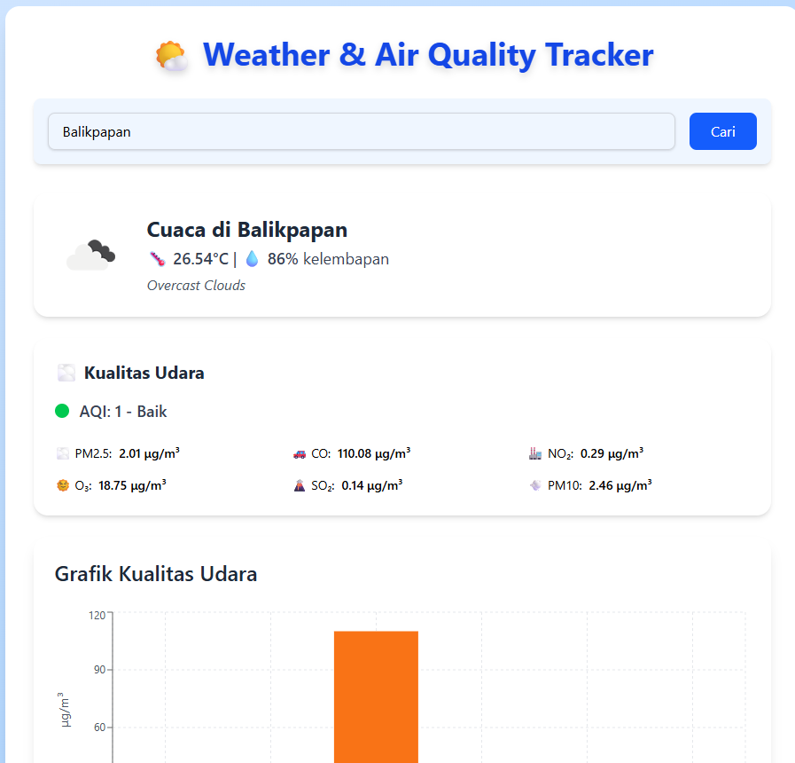
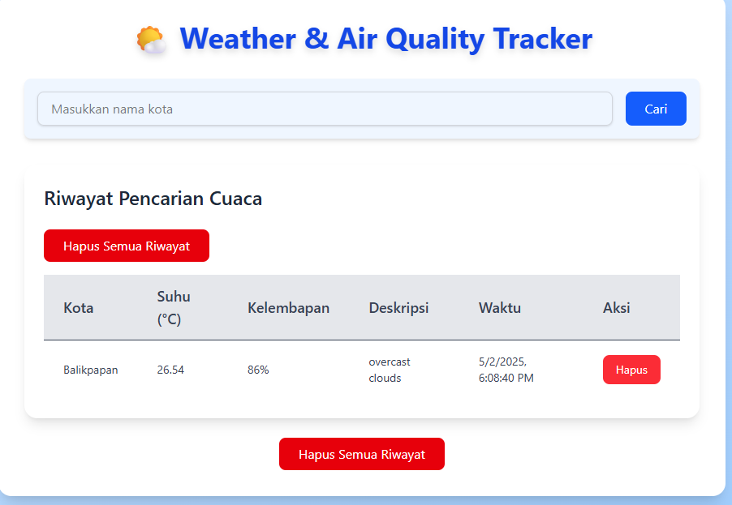
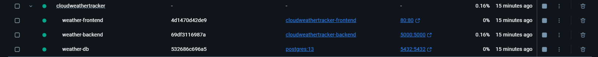

# 🌦️ Cloud Weather Tracker
## Pekan 12: Integrasi dan Docker Compose

## Checkpoint 
1. Integrasi antar layanan backend
2. Mengatur komunikasi antar microservices
3. Membuat file Docker Compose untuk menjalankan semua layanan
4. Implementasi volume untuk persistensi data

## Jawaban Checkpoint

### 1. Integrasi antar layanan backend
Integrasi dilakukan antara backend Flask dengan database PostgreSQL menggunakan SQLAlchemy. Backend membaca dan menyimpan data cuaca serta kualitas udara ke dalam database melalui koneksi DATABASE_URL yang didefinisikan di Docker Compose
```yaml
environment:
  - DATABASE_URL=postgresql://Mikoto:0@db:5432/weather_db
```
lalu 

1. Frontend mengirim permintaan ke /api/weather di backend.
2. Backend mengambil data dari OpenWeather API → menyimpan ke database.
3. Backend juga mengambil data historis dari database untuk ditampilkan kembali ke frontend.


pada gambar menunjukan Frontend melakukan Request ke backend dengan request kota Balikpapan, dan layanan backend mengembalikan data cuaca dan kualitas udara dari OpenWeather API dan menyimpannya ke database.


### 2. Mengatur komunikasi antar microservices
Docker Compose digunakan untuk mengatur jaringan antar service: frontend, backend, dan db. Semua service berada dalam satu network bernama weather-network, memungkinkan backend berkomunikasi dengan database, dan frontend mengakses API backend.
```yaml
# Network agar service bisa saling berkomunikasi
networks:
  weather-network:
    driver: bridge

```

### 3. Membuat file Docker Compose untuk menjalankan semua layanan
```yaml
version: '3.8'

services:
  # Service untuk frontend (React)
  frontend:
    build:
      context: ./FE  # Lokasi Dockerfile untuk frontend
    container_name: weather-frontend
    ports:
      - "80:80"  # Mapped ke port 80 lokal
    depends_on:
      - backend  # Menunggu backend untuk siap
    networks:
      - weather-network

  # Service untuk backend Flask
  backend:
    build:
      context: ./BE  # Lokasi Dockerfile untuk backend
    container_name: weather-backend
    ports:
      - "5000:5000"  # Mapped ke port 5000 lokal
    environment:
      - DATABASE_URL=postgresql://Mikoto:0@db:5432/weather_db  # Koneksi ke database
    depends_on:
      - db  # Menunggu database untuk siap
    networks:
      - weather-network

  # Service untuk PostgreSQL
  db:
    image: postgres:13  # Gunakan image resmi PostgreSQL
    container_name: weather-db
    environment:
      - POSTGRES_USER=Mikoto
      - POSTGRES_PASSWORD=0
      - POSTGRES_DB=weather_db
    ports:
      - "5432:5432"  # Mapped ke port 5432 lokal
    volumes:
      - weather-db-data:/var/lib/postgresql/data  # Persisten data DB
    networks:
      - weather-network

# Network agar service bisa saling berkomunikasi
networks:
  weather-network:
    driver: bridge

# Volume untuk menyimpan data PostgreSQL
volumes:
  weather-db-data:
    driver: local
```
File docker-compose.yml ini menggunakan versi 3.8 dan mendefinisikan tiga service utama: frontend, backend, dan db (PostgreSQL). Masing-masing service berjalan dalam container terpisah dan diatur dalam satu network bernama weather-network agar dapat saling berkomunikasi secara internal.

Service frontend dibangun dari folder ./FE menggunakan Dockerfile React dan menghasilkan container bernama weather-frontend. Service ini akan dijalankan pada port 80 yang di-map ke port 80 lokal, sehingga aplikasi dapat diakses melalui browser tanpa perlu menyebutkan port secara eksplisit. Service ini memiliki depends_on terhadap backend, memastikan backend siap terlebih dahulu sebelum frontend dijalankan.

Service backend menggunakan Flask dan dibangun dari folder ./BE. Container weather-backend dijalankan pada port 5000 dan memiliki variabel lingkungan DATABASE_URL untuk menghubungkan ke service database. Nilai variabel ini menunjuk ke service db pada port default PostgreSQL (5432) dengan user, password, dan nama database yang telah ditentukan. Backend juga menunggu database siap sebelum berjalan menggunakan depends_on.

Service db menggunakan image resmi postgres:13 untuk menyediakan database PostgreSQL. Konfigurasinya meliputi POSTGRES_USER, POSTGRES_PASSWORD, dan POSTGRES_DB, dengan penyimpanan data bersifat persisten melalui volume bernama weather-db-data, yang dipetakan ke direktori /var/lib/postgresql/data di dalam container. Dengan ini, data tidak akan hilang meskipun container di-rebuild.

Semua service berada dalam satu jaringan bridge bernama weather-network, memungkinkan koneksi internal antar-container menggunakan nama servicenya masing-masing. Selain itu, volume weather-db-data didefinisikan agar container database memiliki penyimpanan yang tahan terhadap restart atau rebuild, menjaga konsistensi data dalam pengembangan maupun produksi.


Dokukentasi Container Docker : 


Ada tiga container yang sedang berjalan di bawah satu stack/project bernama cloudweathertracker:

1. weather-frontend

    Container ID: 4d1470d42de9

    Nama container penuh: cloudweathertracker-frontend

    Port yang terbuka: 80:80, artinya layanan frontend (React + Nginx) bisa diakses lewat browser di http://localhost.

    Status: Aktif (ditandai dengan titik hijau)

  

2. weather-backend

    Container ID: 69df3116987a

    Nama container penuh: cloudweathertracker-backend

    Port yang terbuka: 5000:5000, artinya API Flask dapat diakses melalui http://localhost:5000.

    Status: Aktif

  

3. weather-db

    Container ID: 532686c696a5

    Image yang digunakan: postgres:13

    Port yang terbuka: 5432:5432, yaitu port default PostgreSQL yang bisa diakses dari tools seperti pgAdmin, DBeaver, atau aplikasi backend.

    Status: Aktif

   


### 4. Implementasi volume untuk persistensi data
Volume bernama weather-db-data digunakan untuk menyimpan data PostgreSQL secara permanen di luar container.
```yaml
volumes:
  weather-db-data:
    driver: local
    ```
```

# Contributions 
1. Jein Ananda - Fullstack Developer week 9 - 12
2. Muhammad Aulia Rahman - Tidak aktif 9 - 12
3. Dicky Ramadhoni Oktagian - Tidak Aktif 9 - 12

# Link Video

https://drive.google.com/drive/folders/1n9boZEL_QaWRlOV66AmZY9isY5Hi5JOK?usp=sharing
