# 🌦️ Cloud Weather Tracker
## Pekan 13: CI/CD Setup dan Cloud Deployment

## Link 
Backend : https://cloud-weather-tracker-production.up.railway.app/ 

Backend for test API : https://cloud-weather-tracker-production.up.railway.app/api

Frontend : https://cloud-weather-tracker.vercel.app/

## Checkpoint 
1. Setup GitHub Actions untuk CI/CD pipeline dasar
2. Deploy aplikasi ke platform cloud (pilih salah satu: AWS, Google Cloud, Azure, atau layanan alternatif seperti DigitalOcean, Heroku)
3. Konfigurasi environment variables dan secrets

## Jawaban Checkpoint

# 1 + 2 + 3 . Setup GitHub Actions untuk CI/CD pipeline dasar dan deploy aplikasi ke platform cloud dan setting variable

Untuk menjawab point nomor 1,2 dan 3, saya menggunakan dua platform Cloud yang berbeda, untuk Backend saya menggunakan Railways dan untuk frontend saya menggunakan Vercel, untuk penjelasan dimulai dari backend

# Backend Deployment
## 1. Langkah Pertama
Dalam backend diperlukan file baru yaitu Procfile dengan isi 
```
web: gunicorn app:app
```
digunakan untuk menjalankan aplikasi menggunakan gunicorn

lalu Dalam backend diperlukan update file baru yaitu requirements.txt dengan isi 
```
Flask
flask-cors
flask-sqlalchemy
requests
psycopg2-binary
python-dotenv
gunicorn
```

## 2. Langkah Kedua
Dalam backend diperlukan update file di app.py 

`app.py`
```python
@app.route("/init-db")
def init_db():
    try:
        db.create_all()
        return "✅ Database tables created successfully!"
    except Exception as e:
        return f"❌ Error: {str(e)}"
```

pertama membuat fungsi baru dalam app.py dengan nama init-db, dengan tujuan Agar dapat menginisialisasi tabel database PostgreSQL secara manual dari browser atau Postman, terutama setelah deploy pertama kali. 

`config.py`
```python
class Config:
    API_KEY = os.getenv("API_KEY")
    SQLALCHEMY_DATABASE_URI = os.getenv("DATABASE_URL")
    SQLALCHEMY_TRACK_MODIFICATIONS = False
```

perubahan ini dilakukan Agar Flask dapat membaca variable API_KEY dan DATABASE_URL yang dikonfigurasi di Railway Environment Variables. Tanpa ini, backend akan gagal fetch data dari OpenWeatherMap.

## 3. Langkah Ketiga
Setelah melakukan beberapa perubahan pada file backend selanjutnya melakukan Deployment pada Railway, dimana membuat project baru pada railway dengan nama Cloud-Weather-Tracker, lalu masuk ke pengaturan

### 1. Source Repository
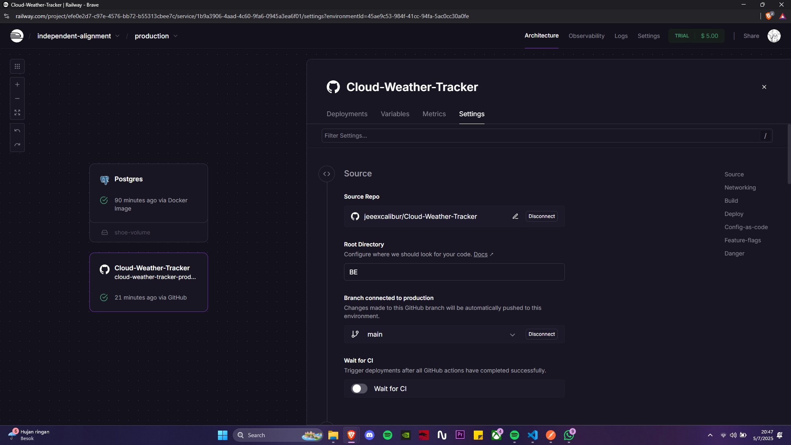

CI/CD (Continuous Integration and Continuous Deployment) dalam proyek ini berjalan secara otomatis melalui integrasi antara Railway dan GitHub.

Setiap kali saya melakukan push atau update ke branch utama (main) pada repository bernama Cloud-Weather-Tracker, Railway secara otomatis akan:
  1. Menarik perubahan terbaru dari repository
  2. Membangun ulang environment backend
  3. Menjalankan proses deployment menggunakan konfigurasi yang telah disediakan
  4. Mengupdate aplikasi secara langsung ke URL live tanpa perlu proses manual

Proyek ini menggunakan struktur direktori dengan folder BE/ (backend) sebagai root deployment. Branch default yang digunakan adalah main, sesuai dengan standar pengembangan di repository ini.

### 2. Region Set
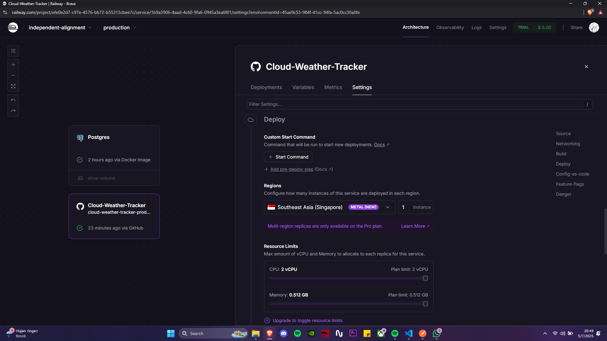
Untuk koneksi server yang maksimal dikarenkan kita berada di Indonesia lokasi server yang paling dekat adalah Singapore, karena itu saya menggunakan server singapore pada backend nya

### 3.Network for Domain
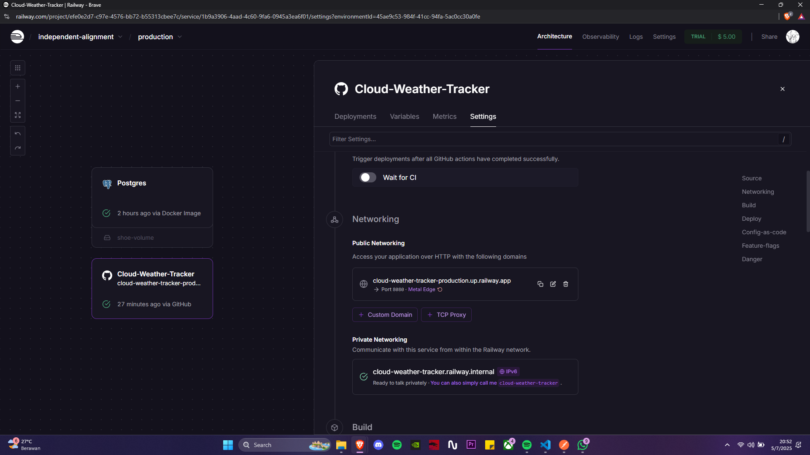
Untuk Network saya menggunakan generate domain default dari railway yang mana tergenerasi secara otomatis oleh railway yaitu 
https://cloud-weather-tracker-production.up.railway.app/

### 4. Variable Set
.png)
Dalam aplikasi ini, dua variabel yang digunakan untuk memastikan aplikasi berjalan dengan baik di Railway adalah: 
1. API_KEY
Variabel ini berisi kunci API dari OpenWeatherMap yang digunakan untuk mengambil data cuaca dan kualitas udara dari API tersebut. API_KEY ini sangat penting karena tanpa kunci yang valid, aplikasi tidak akan dapat mengakses data cuaca dan kualitas udara yang dibutuhkan. Kunci API ini disimpan di environment variables Railway untuk menjaga keamanannya.

Penggunaan:
api_key = Config.API_KEY

2. DATABASE_URL
Variabel ini berisi URL koneksi ke database PostgreSQL yang digunakan oleh aplikasi untuk menyimpan data cuaca dan kualitas udara yang diterima. Variabel ini juga disimpan di environment variables Railway untuk mengonfigurasi database yang digunakan aplikasi, agar bisa diakses secara aman dan terhubung dengan baik saat aplikasi berjalan di server Railway.

Penggunaan:
SQLALCHEMY_DATABASE_URI = os.getenv("DATABASE_URL")

### 5. Deployment
Untuk melakukan deployment saya menggunakan tombol deploy yang ada di bagian kanan atas pada halaman dashboard

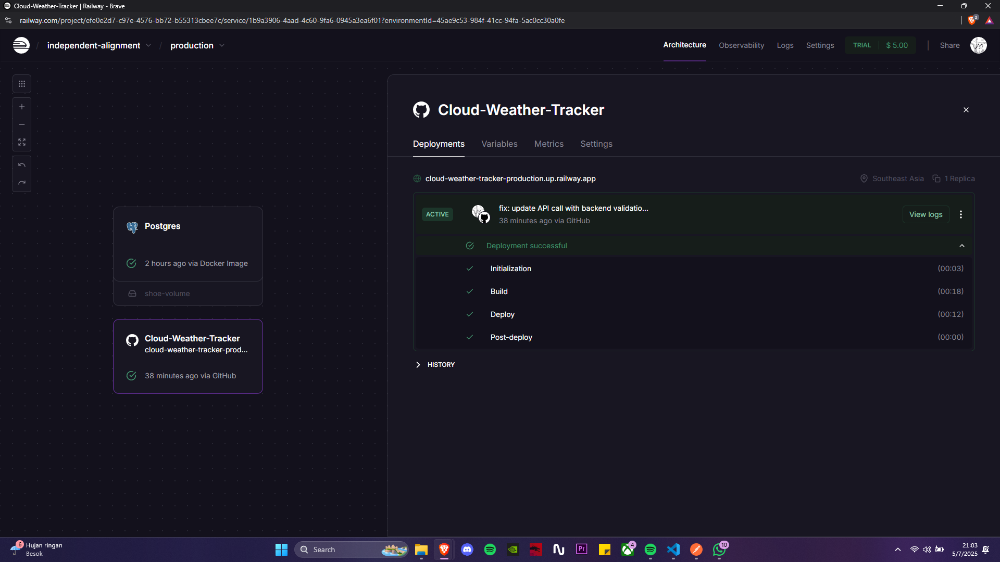

### 6. Database Setup
untuk database melakukan setup untuk postgree, pertama tama copy connection url untuk variables database yang akan digunakan di backend 
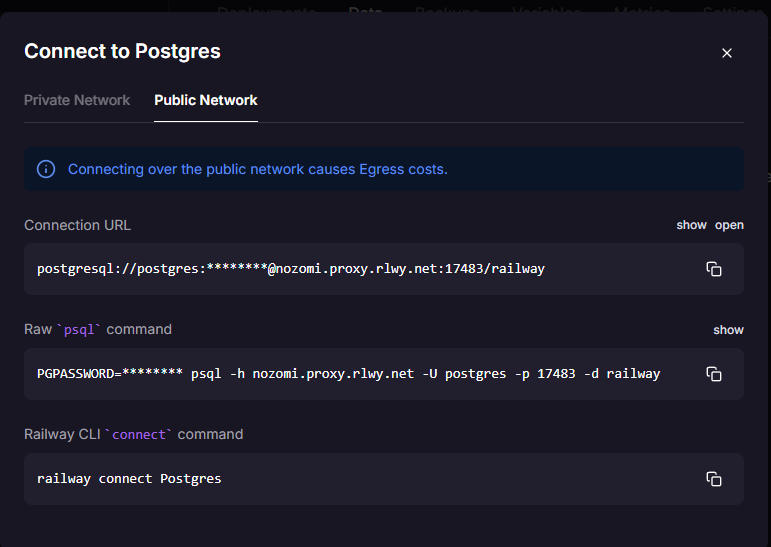

lalu jalankan fungsi init-db pada app.py
```python
@app.route("/init-db")
def init_db():
    try:
        db.create_all()
        return "✅ Database tables created successfully!"
    except Exception as e:
        return f"❌ Error: {str(e)}"
```
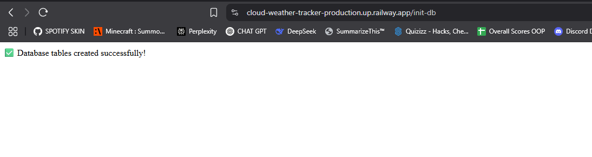

Table akan otomatis terbuat berkat models yang telah dibuat sebelumnya
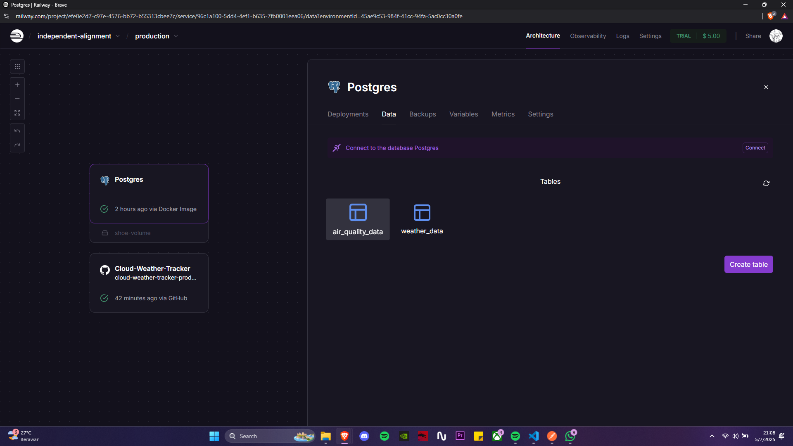


# Frontend

## 1. Langkah Pertama

Melakukan setup project baru di vercel, dan masuk ke pengaturan
dimana source CI/CD menggunakan repository Cloud-Weather-Tracker sama halnya dengan backend sebelumnya akan terus otomatis terupdate setiap saya melakukan push atau update ke repository Cloud-Weather-Tracker, untuk root berbeda dengan BACKEND dikarenakan vercel saya fokuskan untuk Frontend jadi saya menggunakan folder FE/ (frontend) sebagai root deployment. , sesuai dengan standar pengembangan di repository ini.
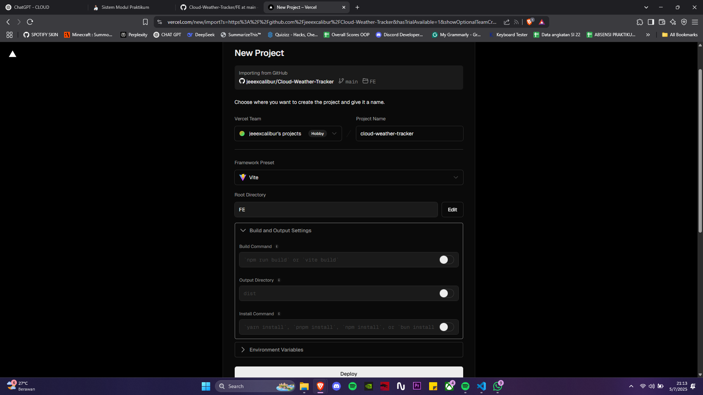

Tampilan jika berhasil deploy
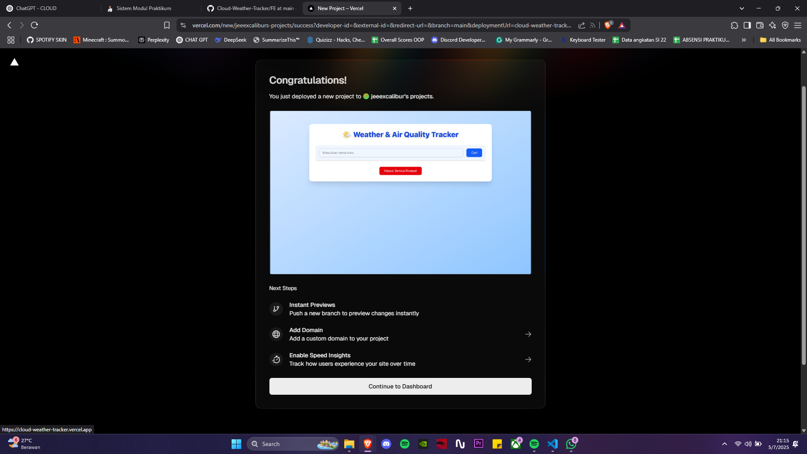

# Testing 

### Landing Page
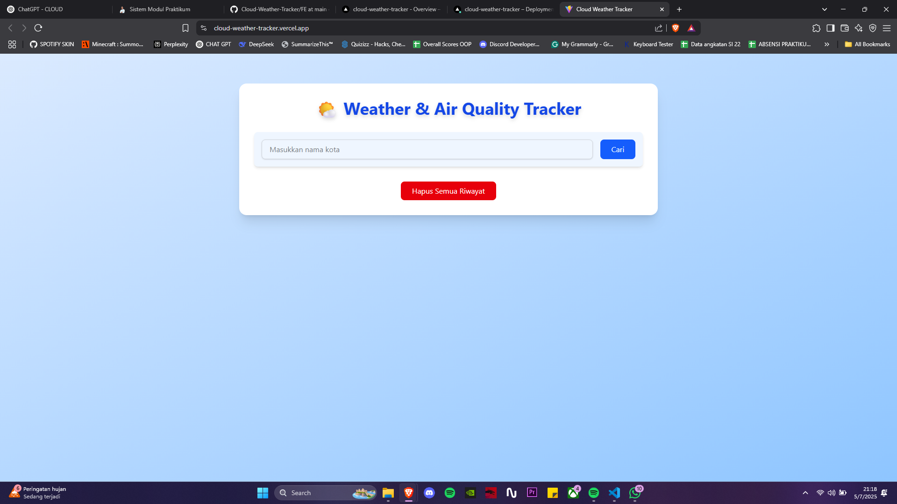

### Search 
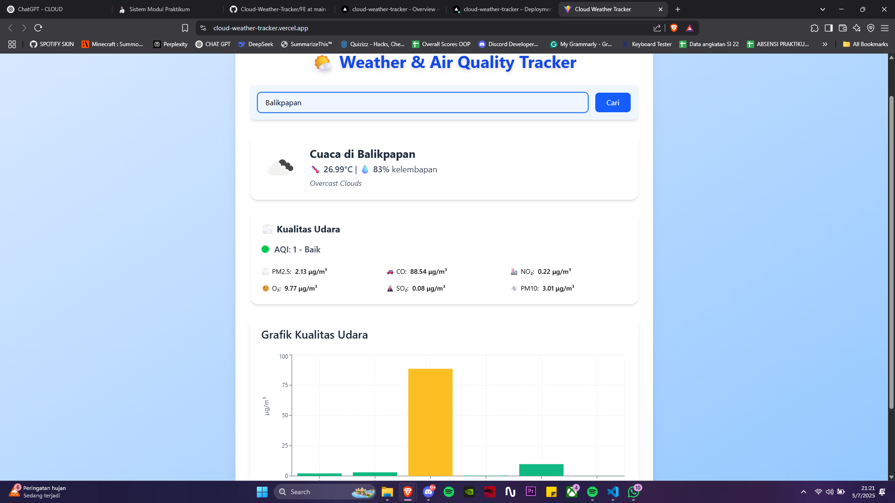

### History
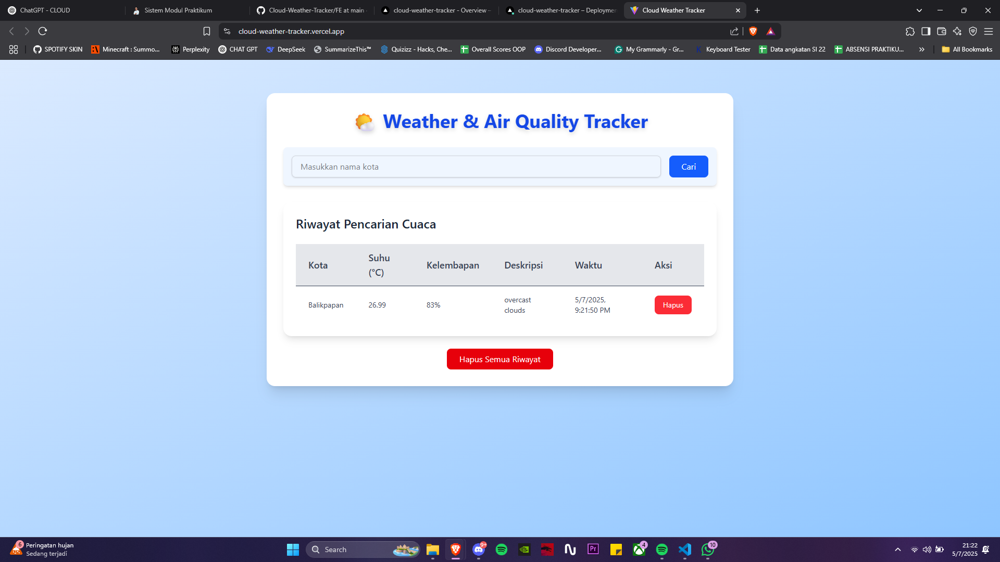

Database

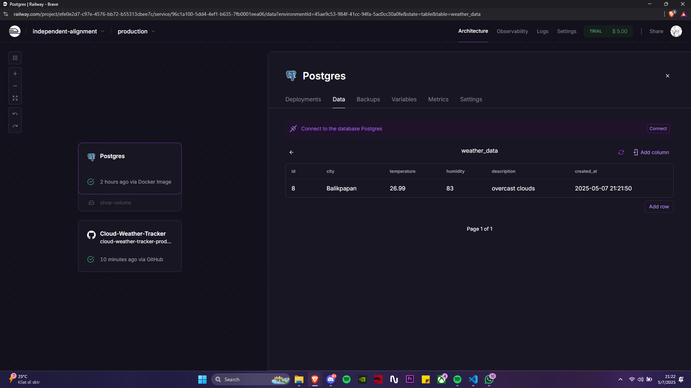
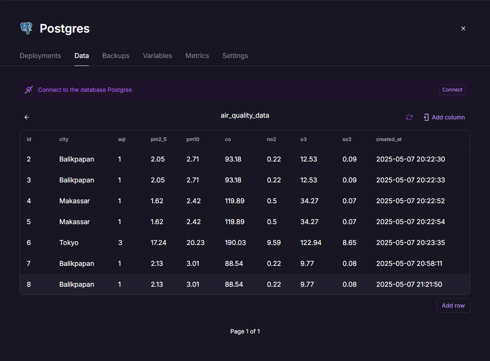

