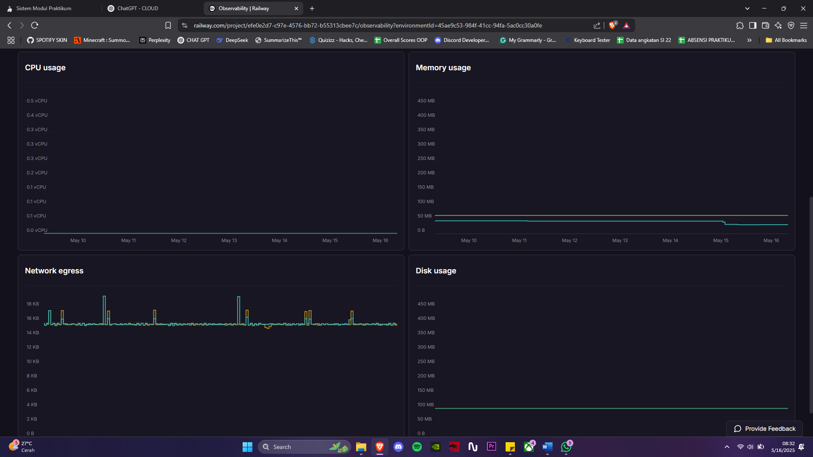
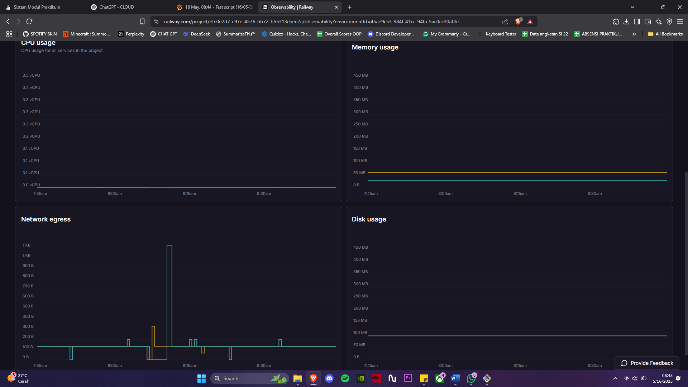
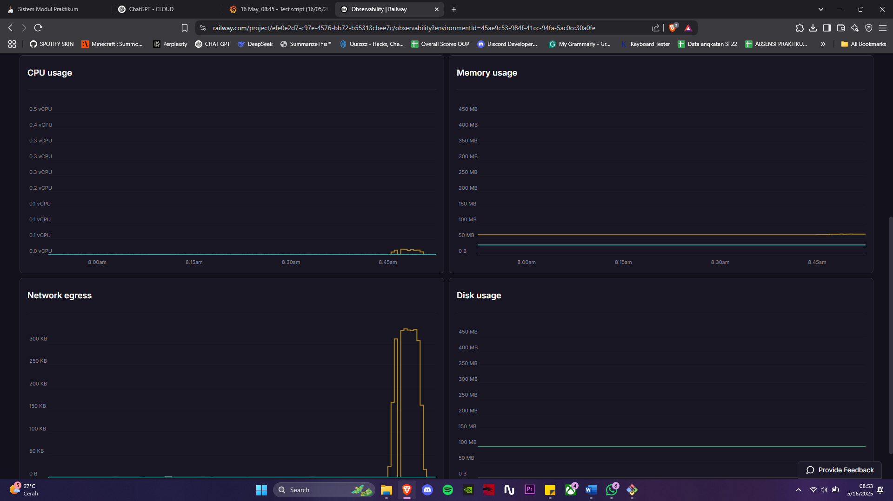
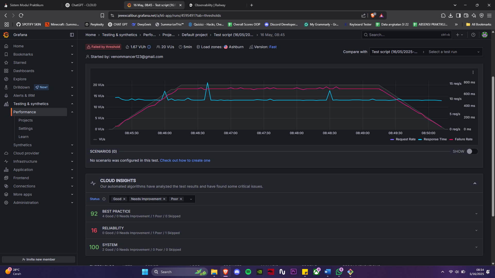

# 🌦️ Cloud Weather Tracker
## Pekan 14: Monitoring, Logging, dan Scaling

## Link 
Backend : https://cloud-weather-tracker-production.up.railway.app/ 

Backend for test API : https://cloud-weather-tracker-production.up.railway.app/api

Frontend : https://cloud-weather-tracker.vercel.app/

## Checkpoint 
1. Implementasi sistem monitoring dengan Prometheus atau layanan cloud monitoring
2. Konfigurasi logging terpusat dengan ELK Stack atau layanan cloud logging
3. Ujicoba scaling manual atau auto-scaling (jika platform mendukung)

## Jawaban Checkpoint

## 1. Implementasi sistem monitoring dengan Prometheus atau layanan cloud monitoring

Monitoring setup untuk implementasi sistem monitoring menggunakan Railway sebagai layanan cloud deployment yang menyediakan monitoring bawaan secara real-time. Monitoring ini mencakup:

- **CPU Usage**: Penggunaan prosesor oleh aplikasi
- **Memory Usage**: Konsumsi RAM dari container aplikasi
- **Network Egress**: Data keluar dari server
- **Disk Usage**: Kapasitas penyimpanan yang digunakan (meskipun tidak dominan)



## 2. Konfigurasi logging terpusat dengan ELK Stack atau layanan cloud logging

Logging dalam aplikasi dilakukan melalui fitur bawaan dari Railway yang otomatis mencatat log backend. Log ini mencakup:
- Permintaan (request) dari client ke endpoint Flask
- Error/exception yang terjadi selama runtime
- Pesan yang ditulis menggunakan `print()` atau `logging`


## 3. Ujicoba scaling manual atau auto-scaling 

Stress test dilakukan menggunakan K6 Cloud dengan konfigurasi:
- 1 menit naik ke 20 Virtual Users
- 3 menit stabil di 20 VUs
- 1 menit turun kembali ke 0

Endpoint yang diuji: `https://cloud-weather-tracker-production.up.railway.app/api/weather`

dan Code 
```js
import { sleep } from 'k6'
import http from 'k6/http'

export const options = {
  stages: [
    { duration: '1m', target: 20 }, // Naik ke 20 VUs dalam 1 menit
    { duration: '3m', target: 20 }, // Tahan 20 VUs selama 3 menit
    { duration: '1m', target: 0 },  // Turun ke 0 dalam 1 menit
  ],
thresholds: {
  http_req_failed: ['rate<0.02'],        // Maksimal 2% request boleh gagal
  http_req_duration: ['p(95)<2000'],     // 95% response time < 2 detik
},
  cloud: {
    distribution: {
      'amazon:us:ashburn': { loadZone: 'amazon:us:ashburn', percent: 100 },
    },
  },
}

export default function main() {
  let response = http.get('https://cloud-weather-tracker-production.up.railway.app/api/weather')
  sleep(1)
}
```

## Hasil Pengamatan 

### 📊 Hasil Observasi dari Railway

#### Before Stress Test

- **CPU Usage** sangat rendah, stabil di bawah 0.1 vCPU
- **Memory Usage** tetap di bawah 60 MB
- **Network Egress** minim, hanya beberapa KB
- **Disk Usage** tidak mengalami perubahan signifikan


#### After Stress Test
- **CPU Usage** naik hingga hampir 0.3 vCPU
- **Memory Usage** menunjukkan sedikit peningkatan ke ~70 MB
- **Network Egress** mengalami lonjakan tajam hingga 300 KB+, menandakan traffic aktif dari test
- **Disk Usage** tetap stabil karena aplikasi tidak menyimpan data secara lokal


### 📈 Hasil Visualisasi K6 via Grafana Cloud



- **Request Rate** stabil di ~11 req/s selama fase puncak
- **Response Time** konsisten ~450–600 ms, menunjukkan aplikasi tetap responsif
- **Failure Rate = 0**, tidak ada request yang gagal
- **Cloud Insights**:
  - **Best Practice**: 92/100 (2 good)
  - **System Health**: 100/100
  - **Reliability**: 16/100 (ada 1 skipped saat puncak load, tidak kritis)

### 💡 Insight Analisis
- Aplikasi berhasil menangani simulasi 20 pengguna aktif secara bersamaan tanpa error.
- Kinerja tetap stabil, dengan waktu respons berada dalam batas normal.
- Lonjakan network dan CPU menunjukkan sistem responsif terhadap peningkatan trafik.
- Tidak ada gejala memory leak atau bottleneck kritis.

### ✅ Kesimpulan Scaling
Aplikasi dinilai **siap digunakan pada skala kecil-menengah**. Dengan simulasi yang realistis dari 20 virtual user dan data live dari Grafana + Railway, dapat disimpulkan bahwa sistem telah mampu menjalankan tugasnya secara efisien dan stabil tanpa perlu auto-scaling untuk saat ini.
