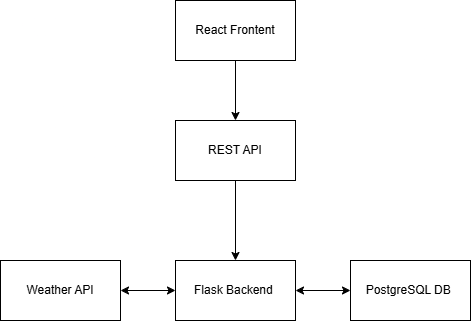
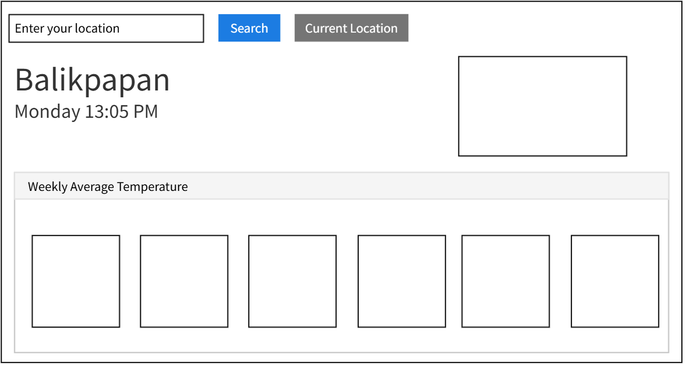

# 🌦️ Cloud Weather Tracker
## Tema : Aplikasi Pemantauan Cuaca dan Kualitas Udara

## Deskripsi Proyek
Cloud Weather Tracker adalah aplikasi web yang memungkinkan pengguna untuk memantau kondisi cuaca terkini berdasarkan lokasi mereka. Data cuaca akan diambil dari API eksternal dan disimpan di database untuk keperluan monitoring dan visualisasi.

## Stack Teknologi
- **Frontend**: React
- **Backend**: Flask (Python)
- **Database**: PostgreSQL
- **Containerization**: Docker

## Scope
- Fetch data cuaca dari API eksternal (misalnya OpenWeatherMap)
- Simpan data ke database PostgreSQL
- Tampilkan data cuaca dalam UI yang responsif (React)
- Arsitektur microservices menggunakan Docker Compose

## Pembagian Tugas
| Nama           | Tugas                           |
|----------------|---------------------------------|
| Jein           | Backend                         |
| Aulia          | Frontend                        |
| Dicky          | DevOps                          |

## Timeline
| Minggu | Kegiatan                        |
|--------|---------------------------------|
| 9      | Penentuan tema & proposal       |
| 10      | Pengembangan Backend Microservices  |
| 11      | Pengembangan Frontend |
| 12      | Integrasi dan Docker Compose            |
| 13      | CI/CD Setup dan Cloud Deployment              |
| 14      | Monitoring, Logging, dan Scaling     |
| 15      | Finalisasi dan Presentasi              |

## Arsitektur Microservices

| Service             | Teknologi     | Tugas                                                                 |
|---------------------|---------------|-----------------------------------------------------------------------|
| **Frontend**         | React         | Menampilkan UI, mengambil data cuaca dari API Backend, dan menampilkan informasi cuaca. |
| **Backend**          | Flask (Python)| Menyediakan endpoint REST API untuk mengakses data cuaca, mengambil data dari OpenWeatherMap, dan menyimpan/fetch data cuaca ke/dari database. |
| **Database**         | PostgreSQL    | Menyimpan data cuaca seperti lokasi, suhu, kelembaban, angin, dan timestamp. |
| **Weather Provider** | OpenWeatherMap (External API) | Menyediakan data cuaca real-time yang diambil oleh backend untuk ditampilkan di frontend. |

### ⚙️ Alur Kerja Microservices

1. **Frontend** (React):
   - Pengguna mengakses aplikasi melalui browser, dan UI mengirimkan request ke Backend (Flask API).
   - Frontend menerima data cuaca (suhu, kelembaban, angin) untuk ditampilkan.

2. **Backend** (Flask):
   - Backend menerima request dari frontend, lalu memanggil OpenWeatherMap API untuk mendapatkan data cuaca terkini.
   - Data cuaca yang didapat dari API eksternal kemudian disimpan ke dalam database PostgreSQL.
   - Jika diperlukan, data cuaca sebelumnya dapat diambil dari database dan disajikan kembali ke frontend.

3. **Database** (PostgreSQL):
   - PostgreSQL menyimpan data cuaca yang telah dikumpulkan untuk keperluan pencatatan dan analisis lebih lanjut.
   - Tabel yang dapat digunakan antara lain: `locations`, `weather_data`, `timestamps`.

4. **Weather Provider** (OpenWeatherMap):
   - API eksternal ini memberikan data cuaca terkini berdasarkan lokasi yang diminta oleh backend.

## Wireframe
